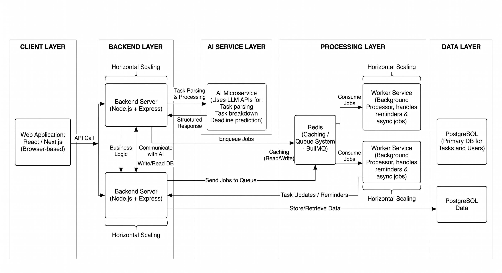

# 🚀 Smart Task Manager with AI Integration

A scalable, AI-powered task management system that supports **natural language task creation, intelligent prioritization, and smart scheduling**, built using **LLMs, Redis, and asynchronous workers**.

---

## 🧠 Overview

This project demonstrates how to design and build a **smart productivity system** that goes beyond CRUD apps by integrating AI for:

* Task understanding (NLP)
* Automated planning
* Dynamic prioritization
* Adaptive reminders

---

## 🏗️ System Architecture




---

### 🔍 Architecture Description

```text
Client (React / Next.js)
        ↓
   API Gateway / Backend
        ↓
     AI Service (LLM Processing)
        ↓
  Task Service (Business Logic)
        ↓
 Redis (Cache + Queue)  ←→ Worker (Async Jobs)
        ↓
     PostgreSQL (DB)
```

---

### 🔄 Data Flow

**1. Creating a task (AI flow)**

* Client → Backend API
* Backend → AI Service (parse natural language)
* AI → returns structured task
* Backend → DB (store task)
* Backend → Queue (schedule reminders)

---

**2. Task prioritization**

* Backend fetches tasks
* Applies prioritization algorithm
* Returns sorted tasks to client

---

**3. Smart reminders**

* Worker pulls jobs from Redis queue
* Sends notifications based on schedule
* Adapts timing using user behavior

---

**4. Task breakdown**

* User requests breakdown
* Backend → AI Service
* AI → returns subtasks
* Stored and linked in DB

---

## ⚙️ Tech Stack

* **Frontend:** React / Next.js
* **Backend:** Node.js / Express
* **AI:** OpenAI API (LLM-based parsing & reasoning)
* **Cache & Queue:** Redis + BullMQ
* **Database:** PostgreSQL
* **Workers:** Node.js background processors
* **Infra:** Docker

---

## 📁 Project Structure

```bash
smart-task-manager-ai/
├── client/
├── server/
├── ai-service/
├── worker/
├── shared/
├── infra/
├── docs/
│   └── system-architecture.png
├── scripts/
├── README.md
```

---

## 📈 Scalability Highlights

* Decoupled AI service for independent scaling
* Redis-based queue for asynchronous processing
* Stateless backend services
* Horizontal scaling support for API servers
* Efficient caching for faster task retrieval

---

## 🧠 Key Features

* Natural language task creation
* AI-based task breakdown
* Intelligent prioritization engine
* Deadline prediction
* Adaptive smart reminders
* Productivity analytics

---

## 🏆 Resume Highlight

Built an AI-powered task management system using LLMs, Redis, and asynchronous job queues, enabling intelligent task parsing, prioritization, and scalable scheduling architecture.